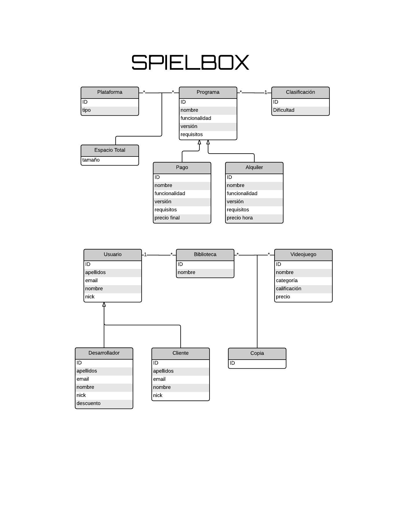

SpielBox
========
This is an application we had to built for Modeling Software subject using Software Engineering techniques.
As the subject was taught in spanish, both the application and [documentation] are in that language.

---
Para la asignatura de Modelado de Software tuvimos que construir una aplicación de gestión de información, teniendo que aplicar Ingeniería del Software.
La mayor parte de la [documentación está aquí en el wiki][documentation], pero los diagramas y el proyecto IBM RSA no está subido.

##Restricciones
- El modelo UML 2.x de la aplicación, será en formato IBM Rational Software Architect 8.0.3.
- El lenguaje de implementación debe ser Java.
- La aplicación puede ser de escritorio o web.
- La persistencia de los datos debe hacerse en formato relacional (se recomienda utilizar MySQL 5.x).
- La arquitectura de la aplicación será multicapa.
- Deben aplicarse los siguientes patrones obligatoriamente en la primera versión de la aplicación:
  - *Application controller*
  - *Application service*
  - *Transfer object*
  - *Data Access Object*
  - Alguna *query* tal y como se vieron en clase.
- Deben aplicarse los siguientes patrones obligatoriamente en la segunda versión de la aplicación:
  - *Business Object*
  - *Domain Store* (implementado con JPA 2.x. Se recomienda usar EclipseLink 2.x).
- Así, la primera versión persistirá los datos directamente en una base de datos relacional, utilizando
objetos transferencia en negocio. La segunda versión, modular, persistirá los datos utilizando JPA,
utilizando objetos del negocio en negocio.
- Ambas versiones gestionarán transacciones y concurrencia.

##Modelo del dominio

[documentation]: https://github.com/hecoding/SpielBox/wiki#%C3%8Dndice
